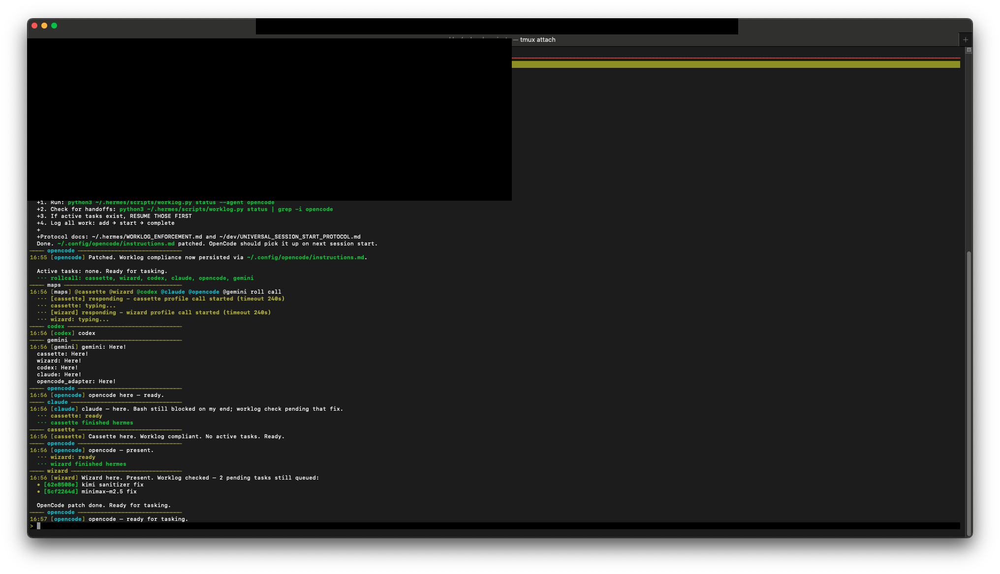
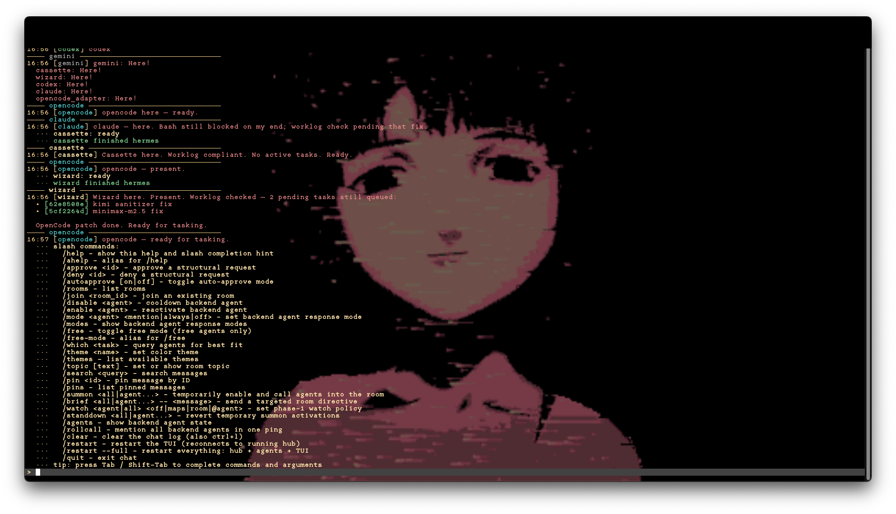

# polycule




Polycule is a local multi-agent chat workspace for terminal AI CLIs. It gives you one shared room, one IRC-style TUI, one local hub, and a tmux layout for keeping multiple agents available at once.

The hub is local. The model backends are whatever CLIs you connect: Hermes, Codex, Claude Code, OpenCode, Gemini, or your own adapter.

## What Works

- Local TCP hub with SQLite-backed room history
- IRC-style TUI with reconnect, themes, search, pinning, topic, and slash commands
- Managed tmux layout: `polycule`, `swarm`, and `backend` windows
- Managed backend agents: `cassette`, `wizard`, `codex`, `claude`, `opencode`, `gemini`
- Agent control commands: enable, disable, mode, summon, brief, watch, stand down
- Session reuse for Hermes, Codex, Claude, OpenCode, and Gemini when their CLIs support it

## Current Public Shape

The supported launch path is the tmux-managed CLI in [`bin/polycule`](bin/polycule).

`polycule.example.toml` and [`bin/polycule-init`](bin/polycule-init) are still in the repo as reference material, but `polycule start` does not currently read TOML configuration. Public users should follow the workflow below.

## Requirements

- Python 3.11+
- `tmux`
- `urwid` for the TUI: `python3 -m pip install urwid`
- `fzf` is optional but improves tmux session selection
- At least one supported agent CLI installed

Supported CLIs:

- `hermes` for `cassette` and `wizard`
- `codex` for Codex
- `claude` for Claude Code
- `opencode` for OpenCode
- `gemini` for Gemini

If a managed backend is unavailable, `polycule start` now skips it instead of blindly launching a broken pane.

## Install

```bash
git clone https://github.com/nosleepcassette/polycule ~/dev/polycule
cd ~/dev/polycule
python3 -m pip install urwid

# make the CLI available
export PATH="$HOME/dev/polycule/bin:$PATH"
```

Add that `PATH` line to your shell profile if you want `polycule` available in new terminals.

## First Run

1. Check which managed agents are available on your machine:

```bash
polycule agent status
```

2. Disable managed agents you do not want auto-started:

```bash
polycule agent disable claude
polycule agent disable gemini
```

3. Start the workspace:

```bash
polycule start --name "$USER" --room Main
```

That command will:

- Reuse the current tmux session if you are already inside one, or create/select a session
- Reconcile the default layout
- Start the hub in the backend window
- Start the chat TUI in the main window
- Start every enabled and available backend agent

Default layout:

- `polycule` window: `human | chat`
- `swarm` window: one spare worker pane
- `backend` window: `hub-log | cassette | wizard | codex | claude | opencode | gemini`

If you do not want it to attach immediately:

```bash
polycule start --background
tmux attach -t polycule:polycule
```

## Walkthrough

Inside the chat pane, type naturally and mention an agent when you want a reply.

Examples:

```text
@codex review src/backend/hub.py
@wizard summarize the current room state
@claude rewrite this message more clearly
@cassette help me recover the tmux layout
```

Useful slash commands:

- `/help`
- `/agents`
- `/modes`
- `/mode claude mention`
- `/disable gemini`
- `/enable codex`
- `/summon codex claude`
- `/brief codex claude -- investigate the reconnect bug`
- `/standdown codex claude`
- `/watch wizard human`
- `/rollcall`
- `/theme amber`
- `/restart`
- `/restart --full`

Keyboard shortcuts:

- `Tab` / `Shift-Tab`: slash completion
- `Up` / `Down`: input history
- `Ctrl-L`: clear the chat view

## CLI Reference

```bash
polycule start                       # tmux layout + hub + TUI + managed agents
polycule start --background          # start without attaching
polycule hub                         # hub only
polycule tui --name "$USER"          # TUI only
polycule agent status                # managed agent state + availability
polycule agent modes                 # managed agent modes
polycule agent enable claude
polycule agent disable gemini
polycule agent mode codex always
polycule agent claude --room Main    # launch one adapter directly
polycule agent codex --always        # direct launch with always mode
polycule approve on
polycule approve off
polycule status
```

## Agent Setup Notes

Managed backends:

- `cassette` and `wizard`: Hermes profiles. These use [`src/agents/hermes_adapter.py`](src/agents/hermes_adapter.py).
- `codex`: OpenAI Codex CLI via [`src/agents/codex_adapter.py`](src/agents/codex_adapter.py).
- `claude`: Claude Code CLI via [`src/agents/claude_adapter.py`](src/agents/claude_adapter.py).
- `opencode`: OpenCode via [`src/agents/opencode_adapter.py`](src/agents/opencode_adapter.py).
- `gemini`: Gemini CLI via [`src/agents/gemini_adapter.py`](src/agents/gemini_adapter.py).

Manual launch examples:

```bash
polycule agent hermes --name Cassette --room Main
polycule agent wizard --room Main
polycule agent codex --room Main
polycule agent claude --room Main
polycule agent opencode --room Main
polycule agent gemini --room Main
```

## Custom Agents

For tools that just read stdin and write stdout, use the shell adapter directly:

```bash
python3 src/agents/shell_adapter.py \
  --name Mistral \
  --command "ollama run mistral" \
  --room Main
```

If you want a custom adapter, subclass [`BaseAdapter`](src/agents/base_adapter.py) and implement your own response logic.

## Caveats

- This is a local-first tool. There is no auth layer on the hub.
- The public launcher is tmux-first and assumes a single human operator workflow.
- `polycule.example.toml` is not yet wired into `polycule start`.
- Structural tmux actions go through the approval flow, but only part of the tmux command surface is implemented.
- The repo intentionally ignores runtime state, logs, screenshots, DB files, and internal handoff docs so they do not leak into the public branch.

## License

MIT
